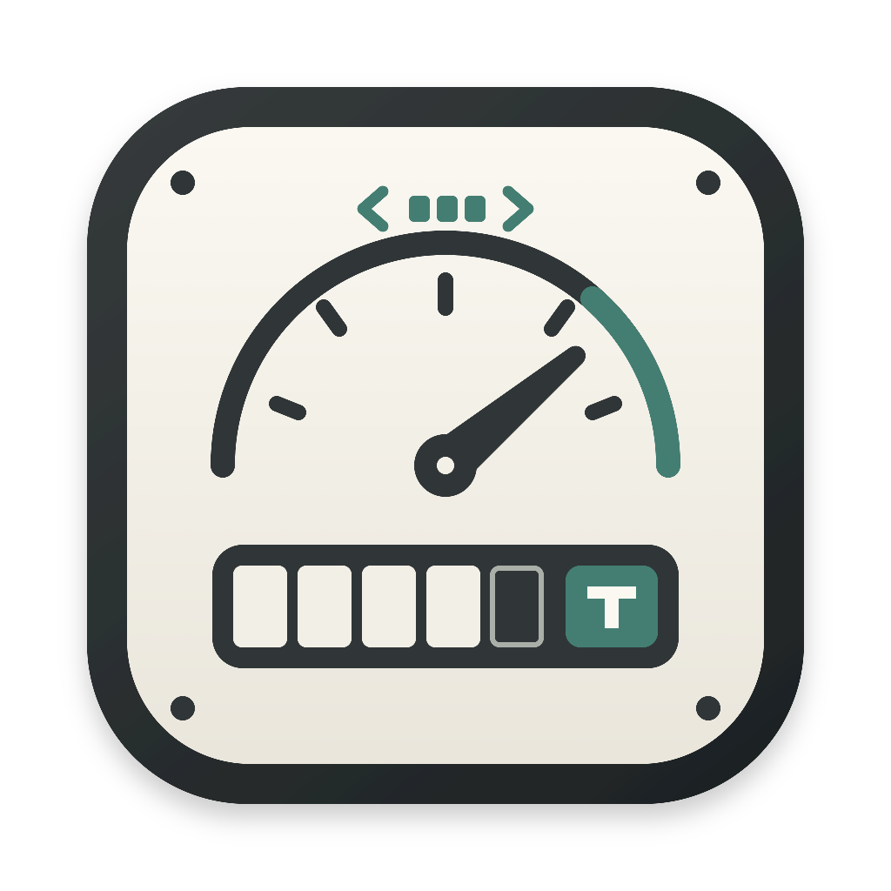
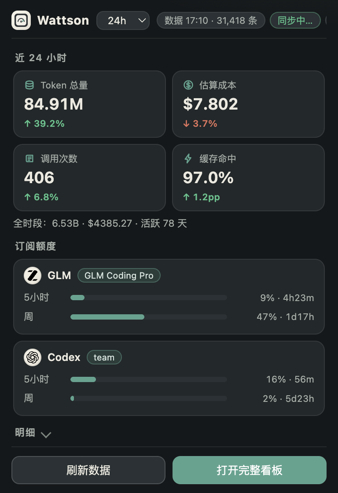
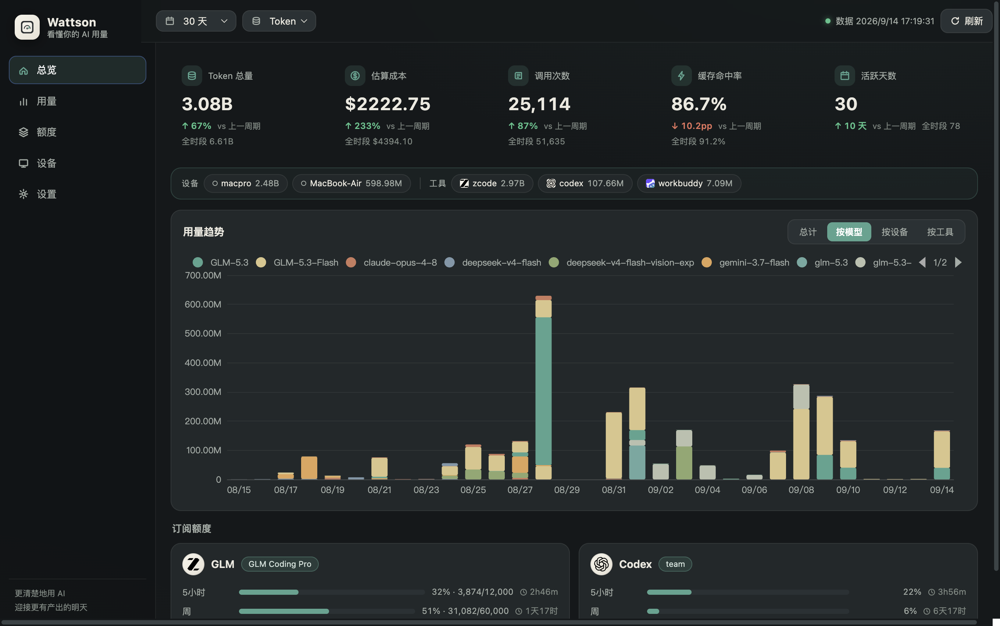

<div align="center">



# ⚡ Wattson

**多机 AI 编码用量侦探**

*The multi-machine AI coding usage detective*

一个常驻菜单栏的小侦探：盯住你**每一台机器**上的 AI 编码工具，把 Token、调用与成本汇成一块本地看板——数据不出你的 Mac。**Swift 原生实现，零第三方依赖。**

[](LICENSE)
[](#-快速开始)
[](#-架构)
[](#-订阅额度卡片16-个账号)

| 菜单栏小窗 | 完整看板 |
|:---:|:---:|
|  |  |

</div>

---

## ✨ 特性

- 🪟 **原生菜单栏 + 看板窗口** —— SwiftUI 原生 App：托盘常显近 24h Token，看板窗口内含 KPI、订阅额度卡片、每日趋势图与模型明细；无 Electron、无 Node、无浏览器
- 🕵️ **原生解析管线** —— 直接发现并解析本机 AI 工具的会话数据（Claude Code / Codex 的 JSONL、ZCode / WorkBuddy 的 SQLite），多台远端机器经 SSH 镜像汇总；按 天/小时 × 设备/工具/模型/项目 任意切片
- 🧾 **订阅额度卡片** —— GLM / Codex / Claude / Cursor / WorkBuddy / Trae / Kimi / Gemini / Grok / Zed / Kiro / Codebuff / Factory / Copilot / OpenRouter / MiniMax 共 16 个账号的额度窗口、已用百分比与重置倒计时，直连各家官方接口只读拉取
- 🛰️ **远端零安装** —— 远端机器只需要系统自带的 `ssh` + `rsync` + `sqlite3`，不留常驻进程；zcode 库在远端投影成 ~2MB 精简快照，增量轮传输 KiB 级（[实测](docs/mirror-volume.md)）
- 🔒 **数据不出本机** —— API 服务只绑 `127.0.0.1`，无遥测、无云端；订阅凭据只在内存解密，不落看板
- 💰 **可解释的成本** —— 内嵌价目快照折算，支持 `~/.config/wattson/model-aliases.json` 别名映射；reasoning-in-output 工具（claude/codex/copilot）按 billable 口径去重计价
- ✅ **测试齐全** —— XCTest 覆盖聚合口径、16 个 provider 的凭据解析与响应归一化、轮询隔离与 TTL、API 路由、采集器并发语义、解析管线与 HTTP 加固，`swift test` 一键回归

## 🧩 支持平台全景

### 📊 用量解析（本机自动发现）

装了哪个工具、`~` 下有它的数据目录，看板就自动出现它——无需配置：

| 工具 | 数据源 | 解析方式 |
|---|---|---|
| Claude Code | `~/.claude/projects/**/*.jsonl` | 原生 JSONL 逐行解析（message.usage） |
| Codex | `~/.codex/sessions/YYYY/MM/DD/rollout-*.jsonl` | 原生 JSONL（token_count 累计值取文件终值，防 resume/fork 重复计费） |
| ZCode | `~/.zcode/cli/db/db.sqlite` | 系统 `sqlite3 -json` 只读查询（session/model_usage 投影） |
| WorkBuddy | `~/.workbuddy/workbuddy.db` | 系统 `sqlite3 -json`（session_usage 会话级估算） |

### 🛰️ 远端多机镜像

远端设备经 `ssh` 拉取式同步，每 30 分钟一轮，单台失败不阻塞其它（`sync/mirror.sh`）：

| 工具 | 远端数据 | 同步机制 |
|---|---|---|
| **ZCode** ⭐ | SQLite | 远端单事务 `ATTACH` 投影出解析所需的 3 张表 → **~2MB**，rsync 以旧镜像为增量基准 + 4KiB 页对齐拉回 |
| **Codex** ⭐ | jsonl 会话目录 | 目录级增量 rsync（`--delete` 跟随远端归档） |
| **WorkBuddy** ⭐ | SQLite | `VACUUM INTO` 一致性快照 → rsync 增量 |

### 🧾 订阅额度卡片（16 个账号）

| 账号 | 凭据来源（本机，自动） | 额度窗口 |
|---|---|---|
| **GLM Coding Plan**（ZCode） | `~/.zcode/v2/credentials.json`（AES-GCM 解密） | 5 小时窗口 + 周额度 |
| **Codex**（ChatGPT） | `~/.codex/auth.json`（受限域名自动走系统代理） | 5 小时窗口 + 周额度 + 重置卡 |
| **Claude Code** | `~/.claude/.credentials.json` | 5 小时窗口 + 周额度 + 周额度（Sonnet） |
| **Cursor** | `~/.cursor/auth.json` 或 `CURSOR_ACCESS_TOKEN` | 5 小时窗口 + 周期额度 |
| **WorkBuddy** | `~/wattson/workbuddy-auth.json`（token 在钥匙串，需手动提供） | 周期额度 |
| **Trae** | `~/wattson/trae-auth.json` 或 `TRAE_ACCESS_TOKEN` | 周期额度 |
| **Kimi** | `~/.kimi-code/credentials/kimi-code.json` 或 `KIMI_CODE_API_KEY` | 周额度 + 速率窗口 |
| **Gemini**（oauth-personal） | `~/.gemini/oauth_creds.json`（过期自动刷新回写） | 按模型每日配额 |
| **Grok** | `~/.grok/auth.json` 或 `GROK_OAUTH_TOKEN` | 订阅周期额度（SuperGrok） |
| **Zed** | `ZED_ACCESS_TOKEN`+`ZED_USER_ID`（或 `ZED_KEYCHAIN=1` 读钥匙串） | 补全额度 + 账期进度 |
| **Kiro** | kiro-cli 本地 SQLite（`KIRO_ACCESS_TOKEN`+`KIRO_PROFILE_ARN` 可覆盖） | 周期额度（CodeWhisperer credits） |
| **Codebuff** | `~/.config/manicode/credentials.json` 或 `CODEBUFF_API_KEY` | 积分额度 + 周额度 |
| **Factory** | `~/.factory/.env` 或 `FACTORY_API_KEY` | 5 小时窗口 + 周额度 + 月度额度 |
| **Copilot** | `COPILOT_API_TOKEN`（GitHub OAuth token） | Premium 请求 + Chat（月度重置） |
| **OpenRouter** | `OPENROUTER_API_KEY` | 账户余额 + Key 限额 |
| **MiniMax** | `MINIMAX_API_KEY` / `MINIMAX_CODING_API_KEY`（`MINIMAX_REGION=cn` 切中国区） | 5 小时窗口 + 周额度 |

## 🚀 快速开始

**方式一：原生菜单栏 App（推荐）**

```bash
git clone https://github.com/makamark/wattson-usage && cd wattson-usage
bash scripts/package-app.sh            # 产物：release/WattsonNative-2.0.1-arm64.dmg
open release/WattsonNative-2.0.1-arm64.dmg
```

> 命名体系与 Electron 时代的 `Wattson-0.1.x-arm64.dmg`（com.wattson.app）明确区分：
> 原生版为 **WattsonNative**（Bundle ID `com.wattson.native`），版本从 **2.0.1** 起线。
> 两者可并存；经即时通讯/AirDrop 分发需先 `xattr -cr /Applications/WattsonNative.app`。

菜单栏出现 ⚡ 图标：左键看各账号额度速览，「打开看板」进完整窗口。首次运行自动扫描本机数据源并开始采集。开发调试可直接 `swift build -c release && open .build/release/WattsonApp`。

**方式二：脚本安装（launchd 常驻，适合中心机/无 GUI）**

```bash
git clone https://github.com/makamark/wattson-usage && cd wattson-usage
bash scripts/setup.sh                  # 交互式向导
# 或非交互：bash scripts/setup.sh --ssh desktop --yes
bash scripts/install.sh                # swift build + 首次镜像 + 装 LaunchAgents
open http://127.0.0.1:8317             # API 即 ready；首次冷启动约 1–2 分钟
```

要求：macOS 13+ · Xcode 或 Swift 工具链（构建期）· 远端设备只需系统自带 `ssh` + `rsync` + `sqlite3`。

<details>
<summary><b>🏗️ 架构一页图</b></summary>

```
 本机（中心机）                                         远端设备（可多台）
 ───────────────────────────────────────              ──────────────────────
 本机活数据（自动发现）                                  真实数据
   ~/.claude/projects/**/*.jsonl                        ~/.zcode/cli/db/db.sqlite
   ~/.codex/sessions/…                                  ~/.codex/sessions/…
   ~/.zcode/cli/db/db.sqlite                            ~/.workbuddy/workbuddy.db
        │                                                    │
        │                                     com.wattson.mirror（launchd，每 30 分钟）
        │                                     sync/mirror.sh 按 agg.config.json 循环多设备：
        │                                       · zcode：远端 sqlite3 单事务 ATTACH 投影
        │                                         只导出解析所需 3 张表（~190MB → ~2MB）
        │                                       · workbuddy：VACUUM INTO 一致性快照
        │                                       · rsync 增量拉回（旧镜像作基准 + 页对齐）
        │                                       · codex sessions：jsonl 目录级增量
        │                                                    │
        │                                                    ▼
        │                                     ~/wattson/mirror/<设备名>/
        │                                       zcode/ workbuddy/ codex/
        │                                                    │
        ▼                                                    ▼
 ┌─────────────────────────────────────────────────────────────────┐
 │ Wattson（Swift 原生，零第三方依赖）                                 │
 │   WattsonApp：菜单栏 + 看板窗口（SwiftUI，含进程内聚合）              │
 │   wattson-server：无头 API 服务（launchd 常驻，127.0.0.1:8317）      │
 │   原生解析管线（JSONL + sqlite3 投影）→ SessionCache → UsageRow[]   │
 │     （host 由数据源路径推断：本机=hostname，mirror 路径=设备名）      │
 └─────────────────────────────────────────────────────────────────┘
        │
        ▼
 菜单栏 App / REST API（GET /api/overview·series·matrix·models·plan·status）
```
</details>

<details>
<summary><b>⚙️ 配置与环境变量</b></summary>

统一配置 `agg.config.json`（已 gitignore，模板 `agg.config.example.json`；launchd 态默认在 `~/wattson/agg.config.json`）：

```json
{
  "server": { "port": 8317, "refreshMinutes": 30 },
  "devices": [
    { "name": "laptop", "local": true },
    { "name": "desktop", "ssh": "desktop" }
  ]
}
```

- `devices`：`local: true` 代表本机；远端每台 `{ "name", "ssh" }`，`name` = 镜像目录名与看板「设备」维度值
- `scripts/gen-config.py`（或 setup.sh）据此生成 `~/.config/wattson/devices.json`；改配置后重跑 `bash scripts/install.sh`
- 本机数据零配置：自动按 hostname 短名挂载；镜像文件 host 由路径前缀推断

| 环境变量 | 作用 | 默认 |
|---|---|---|
| `WATTSON_PORT` | API 监听端口（固定绑 127.0.0.1） | `8317` |
| `WATTSON_REFRESH_MIN` | 重解析间隔（分钟） | `30` |
| `WATTSON_CONFIG` | 配置文件路径 | `~/wattson/agg.config.json` |
| `WATTSON_DEVICES_FILE` | 多设备根声明文件 | `~/.config/wattson/devices.json` |
| `WATTSON_DATA_DIR` | 数据/日志目录 | `~/wattson` |

**价格修正**（自部署/内部模型名默认 $0 计）：

```bash
# ~/.config/wattson/model-aliases.json —— 把内部模型名映射到有价目的模型
{ "my-internal-model": "glm-5.2" }
```
</details>

<details>
<summary><b>🔌 API 一览（127.0.0.1:8317）</b></summary>

聚合端点共享同一套查询条件：`range=24h|today|7d|30d|all` 与 `hosts=/tools=/models=/projects=`（逗号分隔多值）；先过滤再聚合，看板各区块口径一致；非法取值返回 400。

| 端点 | 说明 |
|---|---|
| `GET /api/status` | `{localHost, fetchedAt, lastSuccessAt, refreshing, errors, recordCount, instanceId, configPath, port}` |
| `GET /api/overview?…` | 总 Token/成本/调用数、缓存命中率、活跃天数、按设备/工具汇总（`allTime` 全时段；`estimatedCost` 估算部分；`compare=previous` 环比） |
| `GET /api/series?bucket=day\|hour&group=…&metric=tokens\|cost\|calls` | 主图时间序列（分组超 12 合并「其他」，桶上限 400） |
| `GET /api/matrix?rows=…` | 行×模型 Token 热力矩阵 |
| `GET /api/models?…` | 模型明细表（按 token 总量降序） |
| `GET /api/plan` | 订阅额度（见上表 16 账号；TTL 5 分钟，凭据不出服务端） |
| `POST /api/refresh` | 触发后台全量重解析，立即返回 202 |

安全加固：`/api/*` 校验 Host 必须精确等于 `127.0.0.1:<port>`（防 DNS rebinding）；`POST /api/refresh` 拒绝跨源 Origin（防表单 CSRF）。

**LaunchAgent 启停**：`launchctl load/unload ~/Library/LaunchAgents/com.wattson.{server,mirror}.plist`，日志在 `~/wattson/{server,mirror}.log`；手动前台调试 `swift run wattson-server`。
</details>

<details>
<summary><b>🧯 已知限制</b></summary>

1. 钻取为聚合口径（先过滤再聚合），时间窗钻取到会话明细未做
2. 订阅额度是官方接口只读展示；凭据缺失的账号自动隐藏，不影响用量看板
3. workbuddy 用量是会话级估算，粒度粗于 zcode/codex
4. 成本按内嵌价目快照折算，与实际套餐扣减无关；真实余量看额度卡片；未收录模型成本记 $0，可用 model-aliases 映射
5. 远端数据最长 30 分钟延迟；远端离线时该轮 skipped，看板继续显示旧快照并标注数据时间
6. codex 按文件内增量口径取终值记账（防 resume/fork 重复计费），与 codex 自报账面累计口径不同
7. 只解析已完成调用的用量行，进行中的轮次下一轮刷新才出现
8. 原生解析管线当前覆盖 claude/codex/zcode/workbuddy 四类数据源；解析器架构（`SessionSource` 扩展点）可持续增补更多工具
</details>

## 🧪 测试

```bash
swift test    # 111 个用例：聚合口径 / 16 个 provider / 轮询 / API 路由 / 采集器 / 解析管线 / HTTP 加固
```

所有网络走注入的 fake fetch，测试不出网。

## 📄 License

[MIT](LICENSE)
